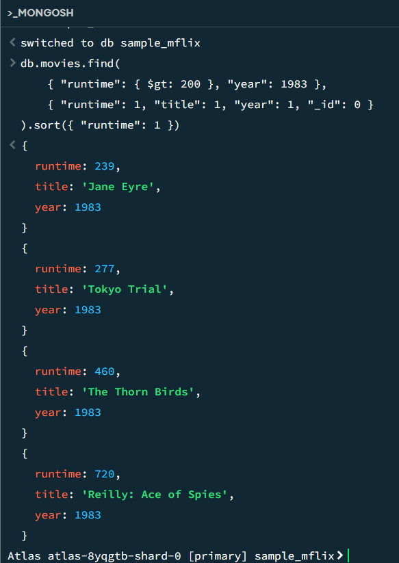
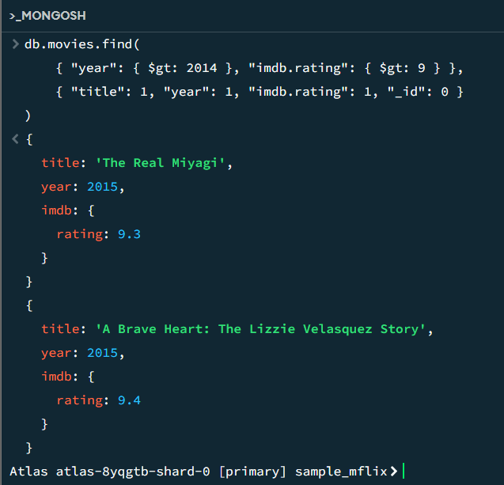

# MongoDB Setup and Queries
- Query 1:  Find all movies with ```runtime``` greater than 200 minutes in ```year``` 1983. The result should include a list of objects sorted by ```runtime``` increasing, and each object only has three fields: ```runtime```, ```title```, ```year```.

- Query 2: Find all movies after ```year``` 2014 with ```imdb rating``` greater than 9.

### Connection String
mongodb+srv://ralaya:<password>@cluster0.tdhy6fz.mongodb.net/

